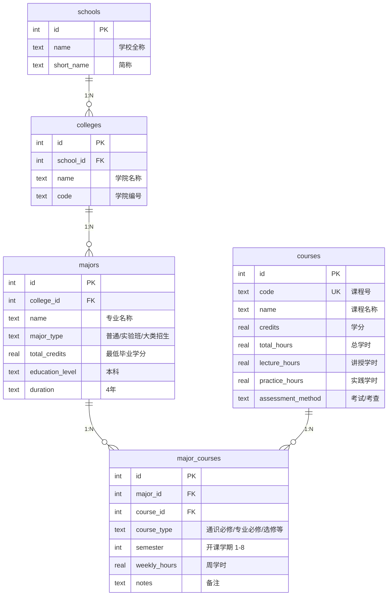

# 培养方案数据库系统

## 项目概述

西南财经大学《数据库原理与应用》课程期末大作业 —— 题目三：培养方案数据库系统。

本系统爬取并解析西南财经大学 2025 级本科人才培养方案 PDF，将其结构化存储到关系型数据库中，提供 8 类查询、CLI 交互界面、跨校对比分析和 NL2SQL 自然语言查询接口（支持规则匹配 + LLM 双模式）。

## 项目结构

```
培养方案数据库系统/
├── run.py                  # 主入口
├── src/
│   ├── database.py         # 数据库连接与 Schema 管理
│   ├── queries.py          # 8 类查询接口实现
│   ├── cli.py              # CLI 命令行界面（含 CJK 字符宽度适配）
│   ├── seeder.py           # SWUFE 数据填充
│   ├── sufe_seeder.py      # SUFE 跨校对比数据
│   ├── nl2sql.py           # NL2SQL 规则引擎 + 10 个测试用例
│   └── nl2sql_llm.py       # NL2SQL LLM 驱动（可选，需 API Key）
├── scripts/
│   ├── init_and_seed.py    # 数据库初始化并导入真实 PDF 数据
│   ├── import_real_data.py # 从培养方案 PDF 提取课程数据
│   └── parse_pdf.py        # PDF 表格解析器
├── tests/
│   └── test_all.py         # 自动化测试（40 项）
├── data/
│   ├── training.db         # SQLite 数据库（891 门课，2604 条关联）
│   └── 培养方案2.zip        # 西南财大原始培养方案 PDF
└── README.md
```

## 功能特性

### 子模块 A：培养方案数据库 ✅

| 功能 | 说明 |
|------|------|
| 数据预处理 | 从西南财大官网下载培养方案 ZIP 包，使用 Python zlib 解压 PDF 流数据 |
| 数据库设计 | 5 张表：schools / colleges / majors / courses / major_courses |
| 必-修课列表 | 查询某专业的必修课列表 |
| 课程信息 | 查询某门课程的学分、学时信息 |
| 总学分要求 | 查询某专业的总学分要求 |
| 开设课程的专业 | 查询开设某门课程的所有专业 |
| 学院概览 | 查询某学院下所有专业的培养方案概览 |
| 模糊搜索 | 关键词模糊搜索课程名称 |
| 用户界面 | CLI 交互模式 + 命令行直接查询 |

### 子模块 B：跨校培养方案对比分析 ✅

| 功能 | 说明 |
|------|------|
| 跨校对比总览 | 对比相同专业在两所学校的总学分、课程数量 |
| 跨校课程对比 | 对比相同专业在两所学校的课程设置异同 |

## 使用说明

### 1. 环境要求

- Python 3.8+
- **必需**：Python 标准库（sqlite3、zipfile、re 等）
- **数据导入**（`scripts/init_and_seed.py`）：需安装 `pdfplumber`
- **LLM 模式**（可选）：无需额外依赖，使用标准库 `urllib`

```bash
# 安装数据导入依赖
pip install pdfplumber

# 安装 LLM 模式依赖（可选 — 如果用 openai 包）
pip install openai
```

如果不需要从原始 PDF 重新导入数据（`training.db` 已随项目提供），则无需安装任何第三方依赖即可运行查询。

### 2. 初始化数据库

```bash
cd "培养方案数据库系统"
python scripts/init_and_seed.py
```

### 3. 运行查询

**交互模式：**
```bash
python run.py
```

**命令行直接查询：**
```bash
# 查询某专业的必修课列表
python run.py 1 "计算机科学与技术"

# 查询某门课程的信息
python run.py 2 "数据结构"

# 查询某专业的总学分要求
python run.py 3 "金融学类（含金融学、人工智能）"

# 查询开设某门课程的所有专业
python run.py 4 "数据库原理与应用"

# 查询某学院下所有专业概览
python run.py 5 "计算机"

# 关键词模糊搜索课程
python run.py 6 "数据"

# 跨校对比总览（模块B）
python run.py 7 "计算机"

# 跨校课程对比（模块B）
python run.py 8 "计算机"
```

## 数据库设计

### ER 图



### 表结构

| 表名 | 说明 | 主要字段 |
|------|------|----------|
| schools | 学校 | id, name, short_name |
| colleges | 学院 | id, school_id(FK), name, code |
| majors | 专业 | id, college_id(FK), name, major_type, total_credits, duration |
| courses | 课程 | id, code, name, credits, total_hours, lecture_hours, practice_hours, assessment_method |
| major_courses | 专业-课程关联 | id, major_id(FK), course_id(FK), course_type, semester, weekly_hours |

### 约束设计

- 主键：每表均使用自增 id 作为主键
- 外键：colleges.school_id → schools.id，majors.college_id → colleges.id，等
- 唯一约束：(school_id, name) 联合唯一，(college_id, name) 联合唯一

## NL2SQL 自然语言查询（模块 B）

支持两种模式，系统自动选择：

| 模式 | 条件 | 说明 |
|------|------|------|
| **LLM 驱动** | 设置 `LLM_API_KEY` 环境变量 | 调用大模型，Few-shot + Schema-aware Prompt |
| **规则匹配** | 未设置 API Key（默认） | 关键词 + 正则匹配，零外部依赖 |

### LLM 模式配置

```bash
# Windows PowerShell
$env:LLM_API_KEY = "your-api-key"
$env:LLM_BASE_URL = "https://api.deepseek.com/v1"   # 可选，默认 OpenAI
$env:LLM_MODEL = "deepseek-chat"                     # 可选，默认 gpt-4o-mini

# Linux / macOS
export LLM_API_KEY="your-api-key"
export LLM_BASE_URL="https://api.deepseek.com/v1"
export LLM_MODEL="deepseek-chat"
```

兼容所有 OpenAI 兼容接口（DeepSeek、智谱 GLM、通义千问、OpenAI 等）。

### Prompt 设计思路

采用 **Few-shot + Schema-aware** 策略：
1. **System Prompt** 注入完整数据库 Schema（5 张表、字段、关系、约束）
2. 提供 **5 个精心构造的 Few-shot 示例**，覆盖必修课/课程信息/学分/专业/学院五类查询
3. 要求 LLM 输出**结构化 JSON**（`{sql, params, description}`），便于程序解析
4. **安全限制**：仅允许 SELECT，禁止 INSERT/UPDATE/DELETE/DROP
5. 参数化查询使用 `?` 占位符防止 SQL 注入

### 测试用例

内置 10 个测试用例，覆盖：

```
"对比两校计算机科学与技术专业的课程差异"
"查询计算机科学与技术的必修课"
"计算机科学与技术专业的总学分是多少"
"数据结构这门课的学分和学时"
"对比西南财经大学和上海财经大学的金融学专业"
"搜索包含数据库的课程"
"查询人工智能专业有哪些课程"
"对比两校计算机专业的总学分差异"
"两校金融学专业的课程设置有什么异同"
"金融学专业需要修多少学分"
```

## 数据范围

当前数据包含西南财经大学以下学院的培养方案：

| 编号 | 学院 |
|------|------|
| 11 | 计算机与人工智能学院 |
| 10 | 管理科学与工程学院 |
| 3 | 金融学院 |
| 6 | 统计学院 |
| 15 | 数学学院 |
| 7 | 工商管理学院 |
| 5 | 会计学院 |
| 1 | 基础学科拔尖实验班 |

## 数据来源说明

| 学校 | 数据来源 | 数据量 | 真实性 |
|------|---------|--------|--------|
| 西南财经大学 | [教务处官网 PDF](https://jwc.swufe.edu.cn/info/1005/37211.htm) | 891 门课，覆盖 8 个学院 | ✅ 真实提取 |
| 上海财经大学 | [信息公开页面 PDF](https://gongkai.sufe.edu.cn/27/a5/c12262a206757/page.htm) | 941 门课，10 个学院 31 个专业 | ✅ PaddleOCR 提取 |

> **说明**：上财 PDF 使用嵌入式字体，无法直接解析。通过 PaddleOCR（`scripts/parse_sufe_ocr.py`）对 415 页 PDF 逐页识别，提取出 941 门真实课程代码和名称，按学院-专业关联。

## 测试

```bash
python tests/test_all.py
```

覆盖：数据库结构（5 表 + 行数校验）、模块 A 全部 6 类查询、模块 B 跨校对比、NL2SQL 自然语言查询（10 个内置用例 + 4 个边界测试）。

## 许可证

本项目为课程作业，仅供学习参考。
